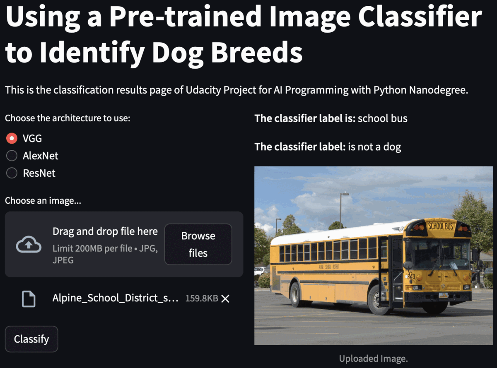

# Introduction 
This repo is part of project submission for Udacity nano degree program "AI Programming with Python".
The purpose of the project is to use pre-trained image classifier to identify if the image is a dog and what breed of dog it is.

# Usage
The program can be run using the command `python check_images.py` in the terminal.
The program takes three arguments: `check_images.py [-h] [--dir DIR] [--arch ARCH] [--dogfile DOGFILE]`
1. Folder path to the images to be classified (default: pet_images/)
2. Architecture to be used for the classifier (default: vgg, options: vgg, alexnet, resnet)
3. File path to the text file containing the list of dog names (default: dognames.txt)

# Project Instructions for running the code in your local machine
1. Clone the repository to your local machine
2. Create a virtual environment using the command `python3 -m venv .venv`
3. Activate it using the command `source .venv/bin/activate`
4. Install the dependencies using the command `pip install -r requirements.txt`
5. Run the command `python check_images.py` to run the program

# Running the pre-trained image classifier as streamlit app
1. Activate the virtual environment previously created using the command `source .venv/bin/activate`
2. Run the command `streamlit run app_streamlit.py` to run the app
3. The app will open in the browser. Select the network architecture and upload the image to be classified
4. Press the "Classify" button to classify the image and display the result
   
## Streamlit app demo
